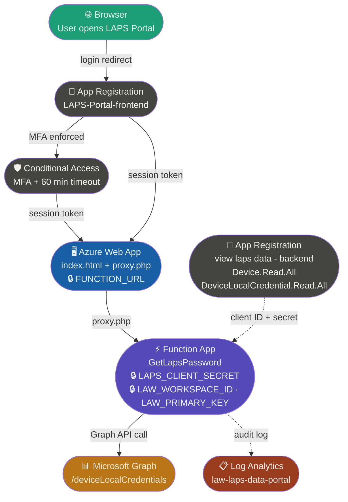

# LAPS Portal

A secure, mobile-friendly web portal for retrieving Local Administrator Password Solution (LAPS) credentials from Microsoft Intune/Entra ID — without needing access to the Intune or Azure portal.


Retrieving a LAPS password the traditional way requires logging into the Intune portal, navigating to the devices tab, searching for the device, and digging through properties to find the password — every single time. That had to be faster.

The LAPS Portal lets helpdesk and IT support staff retrieve LAPS credentials in seconds from any device, including their phone — especially useful when standing next to a device in the field.

## What it is

An Azure Web App with an Azure Function App as the backend, secured by an App Registration for user authentication and Microsoft Graph API calls. It runs at no extra cost on the Azure Free tier.

## Features

- 🔐 Secured with Microsoft Entra ID authentication
- 👥 Access restricted to a specific Entra ID group
- 📱 Mobile-friendly — works on any device
- 📋 One-click password copy
- 🔍 Shows LAPS account, password, last rotation and next rotation
- ⚠️ Warns when a password has expired
- 📊 Full audit logging to Log Analytics (who looked up what and when)
- 🔒 MFA required via Conditional Access policy
- ⏱️ Automatic session timeout after 1 hour

---

## Automated installation

You can deploy the entire LAPS Portal automatically using a single PowerShell script. The script automates every step and has the portal up and running in just a few minutes.

### What the script does

The script automatically:

- Creates the Resource Group
- Creates the Log Analytics Workspace
- Creates the Azure Function App and deploys the function code
- Creates the Web App with a unique URL
- Creates the frontend App Registration with the correct redirect URI
- Grants admin consent so users never see a permissions prompt
- Deploys `index.html` and `proxy.php` to the Web App
- Enables App Service Authentication with Microsoft as the identity provider
- Restricts access to the `LAPS-Portal-Admins` Entra ID group
- Creates a Conditional Access policy requiring MFA and a 1-hour session timeout

### Requirements

- An active Azure subscription with **Owner** permissions
- One of the following Entra ID roles:
  - **Global Administrator** (easiest, covers everything), or
  - **Application Administrator** + **Conditional Access Administrator** (least privilege)
- Access to Azure Cloud Shell

---

## How to install

### Step 1 — Open Azure Cloud Shell

Go to [portal.azure.com](https://portal.azure.com) and open Cloud Shell by clicking the terminal icon in the top bar. Make sure **PowerShell** is selected as the shell type.


---

### Step 2 — Sign in to Microsoft Graph

Before running the script, sign in to Microsoft Graph by running the following command in Cloud Shell:

```powershell
Connect-MgGraph -Scopes "Application.ReadWrite.All","Directory.ReadWrite.All","AppRoleAssignment.ReadWrite.All","Policy.ReadWrite.ConditionalAccess","Policy.Read.All" -UseDeviceAuthentication
```

You will see a device code and a URL. Open the URL in your browser, enter the code and sign in with your Azure admin account.


---

### Step 3 — Run the installation script

Once signed in to Microsoft Graph, run the installation script with this single command:

```powershell
Invoke-Expression (Invoke-WebRequest -Uri "https://raw.githubusercontent.com/iamsysadmin/LAPS-portal/main/laps_portal_script.ps1" -UseBasicParsing).Content
```

The script will run through all steps automatically and show the progress in the console. At the end you will see the portal URL.


---

### Step 4 — Add users to the LAPS-Portal-Admins group

After the script completes, go to **Entra ID → Groups → LAPS-Portal-Admins** and add the helpdesk and IT support users who need access to the portal.

---

### Step 5 — Open the portal

Browse to the URL shown at the end of the script output. Sign in with your Microsoft account and you are ready to go!

> **Note:** The first load may take a few seconds as the Free F1 plan wakes up after inactivity.


---

## Cleanup

If you want to remove all resources created by the installation script, run the cleanup script:

```powershell
Invoke-Expression (Invoke-WebRequest -Uri "https://raw.githubusercontent.com/iamsysadmin/LAPS-portal/main/laps_cleanup_script.ps1" -UseBasicParsing).Content
```

Type `yes` to confirm when prompted.


The cleanup script removes:

- The Resource Group and all Azure resources inside it (Function App, Web App, App Service Plan, Log Analytics Workspace, Storage Account)
- The backend App Registration (`View Laps data`)
- The frontend App Registration and Enterprise Application (`LAPS-Portal-frontend`)
- The Conditional Access policy

> **Note:** The `LAPS-Portal-Admins` Entra ID group is **not** removed by the cleanup script so your group membership is preserved.

---

## Audit logging

Every lookup is logged to Log Analytics with the user's UPN, device name, IP address and result. To query the log, go to your Log Analytics Workspace → Logs and run:

```kql
LAPSPortal_CL
| extend LocalTime = TimeGenerated + 2h
| project LocalTime, CallerUPN_s, DeviceName_s, AccountName_s, CallerIP_s, Result_s
| order by LocalTime desc
```

> `+2h` converts UTC to Central European Summer Time (CEST). Use `+1h` in winter (CET).

---

## Architecture



> Solid lines = main data flow &nbsp;|&nbsp; Dashed lines = auth / supporting

- **Browser** — user opens the portal, gets redirected to Microsoft login
- **App Registration (frontend)** — handles OAuth login flow via App Service Authentication
- **Conditional Access** — enforces MFA and 60 minute session timeout
- **Azure Web App** — serves the UI and acts as a secure proxy to the Function App
- **Function App** — queries Microsoft Graph for LAPS credentials and writes audit logs
- **App Registration (backend)** — authenticates the Function App against Microsoft Graph
- **Microsoft Graph** — returns LAPS account name, password and rotation dates
- **Log Analytics** — stores every lookup with user, device, IP and result

---

## Blog post

Read the full blog post with manual setup instructions at:
[Building a Secure LAPS Password Portal with Azure and Microsoft Graph](https://www.iamsysadmin.eu/mobile-device-managment/intune/building-a-secure-laps-password-portal-with-azure-and-microsoft-graph/)

---

## Author

**Remy** — [@iamsysadmin](https://github.com/iamsysadmin)
